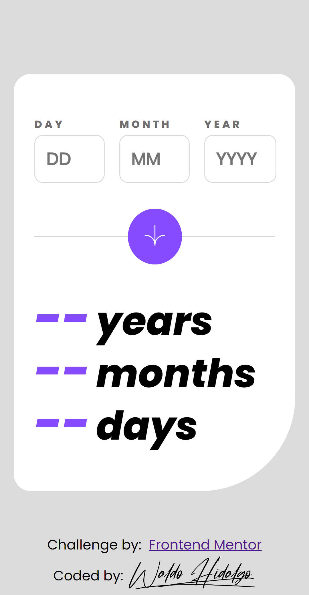
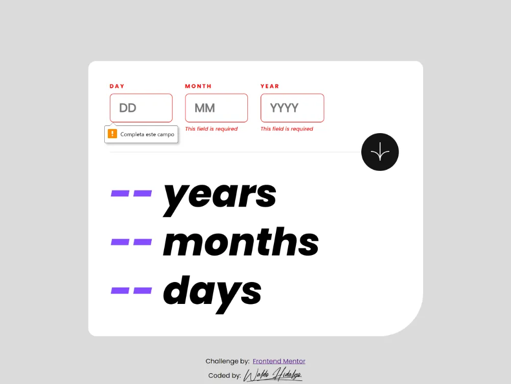
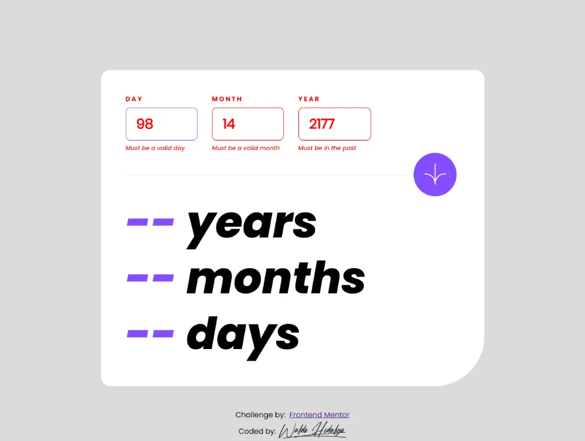

# Frontend Mentor - Age calculator app solution

Esta es mi solución al desafío [Age calculator app challenge on Frontend Mentor](https://www.frontendmentor.io/challenges/age-calculator-app-dF9DFFpj-Q). He utilizado el framework Next.js y las librerías React, [Moment](https://momentjs.com/) para la manipulación de fechas y [CountUp.js](https://inorganik.github.io/countUp.js/) para darle animación al año, mes y día.

El proyecto, inicialmente, lo había finalizado utilizando **JQuery** pero quise desafiarme en crear desde ahora en adelante solo proyectos con frameworks utilizados en la actualidad, principalmente, Next.js con React e ir aprendiendo vía construcción de proyectos como este.

A continuación muestro mi proyecto en pantallas grandes y pequeñas.

## Pantallas Grandes

## Pantallas Small

Ahora muestro los estados de error pedidos como requisitos del proyecto:

## Estados Campos Vacíos

## Estados Input Inválidos fuera de rango

## Estados Fecha completa No Válida

